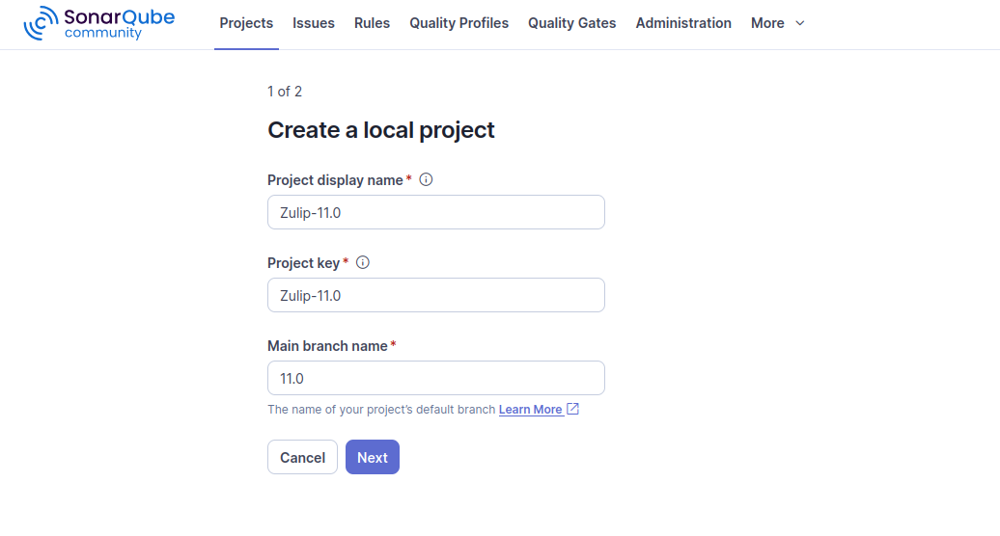
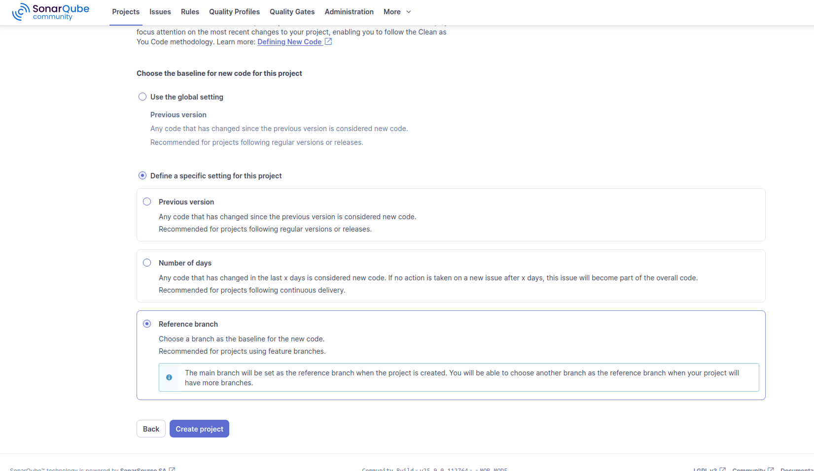
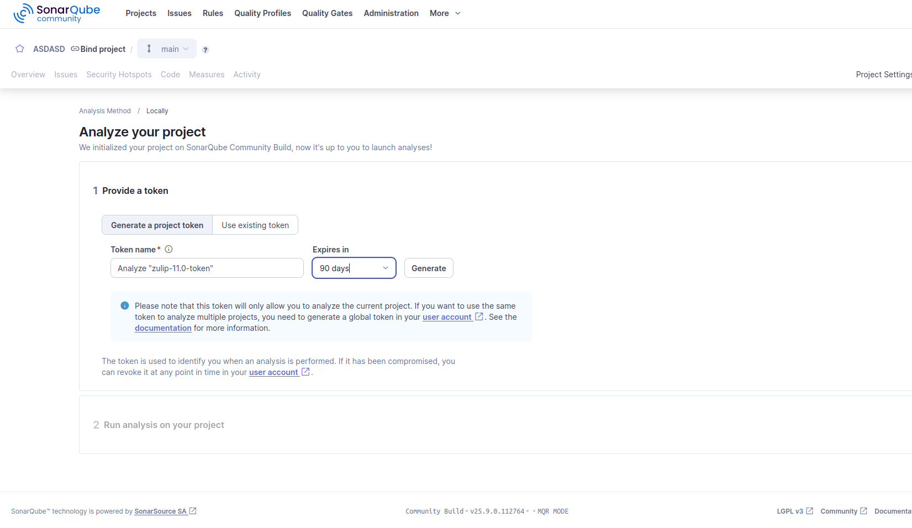

# Infraestrutura de Qualidade de Código

> **Trabalho de Conclusão de Curso**: Os impactos do uso de Inteligência Artificial no processo de produção de código
> 
> **Curso**: Engenharia de Software
> 
> **Universidade**: Universidade de Brasília - Campus FCTE
> 
> **Autores**: Eric Chagas de Oliveira e Lude Yuri de Castro Ribeiro

Repositório para setup da infraestrutura de análise de qualidade do software Zulip com o Sonarqube.

# Repositório de Infraestrutura de Qualidade de Código

## Visão Geral

Este repositório contém a infraestrutura e as configurações necessárias para realizar análises de qualidade de código **Python** localmente. O ambiente utiliza o **PySonar**, uma ferramenta que integra a análise de código Python com a plataforma SonarQube. O objetivo é identificar:

* **Bugs**: Erros lógicos e falhas que podem causar comportamento inesperado.
* **Vulnerabilidades**: Falhas de segurança que podem ser exploradas.
* **Dívida Técnica**: Complexidade de código e problemas de manutenção.
* **Padrões de Código**: Violações de regras de estilo e boas práticas.

---

## Tecnologias Utilizadas

A infraestrutura é construída com as seguintes tecnologias:

* **Docker e Docker Compose**: Para orquestrar e gerenciar os contêineres do SonarQube e seus serviços dependentes (como o banco de dados).
* **SonarQube**: A plataforma principal para a análise de qualidade de código.
* **SonarScanner**: A ferramenta de linha de comando que executa a análise em cada repositório de código.
---

Com os arquivos disponibilizados nesse repositório, é possível:
1. Provisionar o ambiente local do sonarqube (community) localmente com conexão à um banco PostgreSQL local para armazenamento das informações de scan. 
1. Executar scans recorrentes no código do zulip usando a ferramenta sonar-scanner também em containers.

## Como Usar

### Pré-requisitos

Certifique-se de ter o **Docker** e o **Docker Compose** instalados em sua máquina.

### 1. Clone o repositório do zulip

Clone o repositório (fork) do Zulip no diretório de sua preferência.

```bash
  git clone git@github.com:TCC2-Lude-Eric-2025-2/zulip-11.0.git
``` 

Copie os arquivos `docker-compose.yaml`, `Dockerfile-sonarqube`, `sonar-project.properties` e `sonar-scan.sh`.

###### A cópia pode ser manual, ou caso esteja no linux, executando o comando abaixo na raiz do repositório `quality-analysis-infra`


```bash
cp docker-compose.yaml Dockerfile-sonarqube sonar-project.properties sonar-scanner.sh {caminho/para/repositorio/local/zulip}
```

### 2. Iniciar a Infraestrutura

#### 2.1 Subir o sonarqube e banco PostgreSQL

Para subir os serviços, execute o seguinte comando:

```bash
docker-compose up -d
```

Este comando irá criar e iniciar os contêineres do SonarQube e do banco de dados em segundo plano (-d).

### 3. Acessar o SonarQube e criar projeto Zulip V11.0

#### 3.1. Acessar Sonar local

Após alguns minutos, o SonarQube estará disponível no endereço http://localhost:9000.

- Usuário padrão: admin
- Senha padrão: admin

Mais informações na [documentação oficial](https://docs.sonarsource.com/sonarqube-community-build/try-out-sonarqube/).

#### 3.2. Criar projeto

1. No canto superior direito da tela, clique no sinal de + (ou no botão Create Project dependendo da sua versão) e selecione Create local project.

2. Preencha o campo Project key e Display name. Use o mesmo nome para ambos para manter a consistência, por exemplo:



- Project key: Zulip-11.0

- Display name: Zulip-11.0 

###### OBS: O Project key é um identificador único, então é crucial que ele seja preciso.

3. Lembre-se se selecionar "Main branch name" como 11.0, para que os scans comparem o novo código sempre à branch de referência 11.0

4. Na tela seguinte selecione as opções "Define a specific setting for this project" e "Reference branch"



#### 3.3. Gere um token

1. Na próxima tela, clique na opção "Locally" para gerar um token de aceso local
2. Você verá a opção Provide a token. Clique em Generate a project token.
3. Dê um nome ao token, como Zulip-11.0-token.
4. Clique em Generate novamente.



O token será exibido. Copie-o imediatamente e salve em um lugar seguro. Você não conseguirá vê-lo novamente.

### 4. Executar o scan

Navegue para a raiz do seu repositório local do zulip.

```bash
cd {caminho/para/repositorio/local/zulip}
```

1. Edite o arquivo `sonar-project.properties` e substitua {project_token} com o token do seu projeto.

###### OBS: Caso tenha criado um projeto com um nome diferente, altere os respectivos valores para nome e versão do projeto também.

2. Adicione permissão de execução para o seu usuário no script shell de scan:

```bash
sudo chmod +x ./sonar-scan.sh
```

3. Por fim, execute o scan:

```bash
./sonar-scan.sh
```

###### Após a configuração inicial, sempre que for necessário rodar novos scans, basta subir o sonar e o banco com `docker-compose up -d` e rodar o script de scan `./sonar-scan.sh`